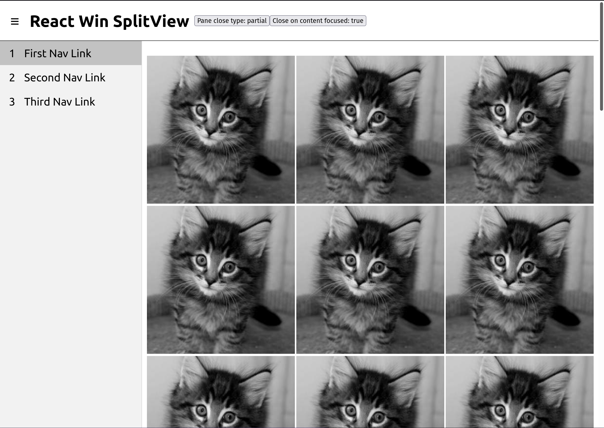

# @nozzlegear/react-win-splitview

An attempt to recreate the SplitView element from WinJS, with full TypeScript definitions.



## Installation

With [Yarn](https://github.com/yarnpkg/yarn):

```shell
yarn install @nozzlegear/react-win-splitview
```

Or from [NPM](https://npmjs.com/package/@nozzlegear/react-win-splitview):

```shell
npm install @nozzlegear/react-win-splitview --save
```

## Importing

Import the component via ES6 import:

```js
import { SplitView } from "@nozzlegear/react-win-splitview";
// or use default import
import SplitView from "@nozzlegear/react-win-splitview";
```

## Example

```tsx
import { SplitView } from "@nozzlegear/react-win-splitview";
import { SplitViewNavMenu } from "@nozzlegear/react-win-splitview";

const NavMenu = () => {
    const links = [
        {
            label: "First Nav Link",
            href: "/test/one",
            icon: "1"
        },
        {
            label: "Second Nav Link",
            href: "/test/two",
            icon: () => <div>{"2"}</div>
        },
        {
            label: "Third Nav Link",
            href: "/test/three",
            icon: <div>{"3"}</div>
        }
    ]
    // An optional link component can be used for interop with navigation frameworks like React Router or React Navi.
    const linkComponent = ({children, ...props}) => {
        return (
            <a {...props}>
                {children}
            </a>
        )
    }

    return (
        <SplitViewNavMenu items={links} linkComponent={linkComponent} />
    )
}

const App = () => {
    const [open, setOpen] = React.useState(false);
    const [closeOnContentFocused, setCloseOnContentFocused] = React.useState(false);
    const [closeType, setCloseType] = React.useState<"full" | "partial">("partial");

    // Event handlers
    const toggleOpen = () => setOpen(!open);
    const toggleCloseOnContentfocused = () => setCloseOnContentFocused(!closeOnContentFocused);
    const toggleCloseType = () => setCloseType(closeType === "full" ? "partial" : "full");

    // Note: this package does *not* include a top navigation bar component.
    return (
        <div>
            <nav className="nav" style={{display: "flex"}}>
                <div className="controls">
                    <button className="toggle-button" type="button" onClick={toggleOpen}>
                        &#8801;
                    </button>
                </div>
                <h1>{"React Win SplitView"}</h1>
                <div className="controls">
                    <button type="button" onClick={toggleCloseType}>
                        {"Pane close type: " + closeType}
                    </button>
                    <button type="button" onClick={toggleCloseOnContentfocused}>
                        {"Close on content focused: " + closeOnContentFocused}
                    </button>
                </div>
            </nav>
            <SplitView
                open={open}
                closeType={closeType}
                closeOnContentFocused={closeOnContentFocused}
                navAriaLabel="Navigation"
                mainAriaLabel="Main content"
                onClose={() => setOpen(false)}
                navContent={NavMenu}
            >
                <div>
                    <h1>{"Hello world!"}</h1>
                </div>
            </SplitView>
        </div>
    );
}
```

## Props

Note: This package has full TypeScript definitions! You should automatically receive intellisense for all of the props documented below:

| Name | Type | Required | Description |
|------|------|----------|-------------|
|`open`| `boolean`| Required | Whether the SplitView pane is open or not. |
|`closeType`| `"full" \| "partial"`| Required | Tells the SplitView how to display when closed. Use `full` to close the SplitView completely, and `partial` to keep a small sliver of it open to show icons. |
|`onClose`| `() => void` | Required | A function that's called when the SplitView wants to close itself. Note that this is only the SplitView requesting to be closed, it will not close itself. |
|`navContent`| `React.ReactNode \| ((props: NavRenderProps) => React.ReactNode)`| Required | Content to show in the SplitView's menu. Typically this is a component that renders a list of navigation links. This package includes a default `SplitViewNavMenu` component that can be used here. |
| `children` | `React.ReactNode` | Required | Content to show in the SplitView's content area (i.e. where your app/page goes). |
|`navAriaLabel`| `string`| Optional | Aria label for the SplitView's navigation menu. **Default: `"Navigation"`**. |
|`mainAriaLabel`| `string`| Optional | Aria label for the SplitView's main content area. **Default: `"Main content"`**. |
|`closeOnContentFocused`| `boolean`| Optional | Whether the SplitView should request to be closed when the user interacts with the main content (not the navigation content). **Default: `false`**. |

## Styling

If you'd like to style the SplitView components yourself, you can change the following CSS variables with your own stylesheet:

| Name | Default value |
| ---- | ------------- |
| `--sidebar_background_color` | `#f2f2f2` |
| `--sidebar_border_right` | `1px solid rgba(0, 0, 0, 0.1)` |
| `--sidebar_top_offset` | `0` |
| `--sidebar_left_offset` | `0` |
| `--sidebar_height` | `100vh` |
| `--sidebar_open_width` | `25vw` |
| `--content_open_width` | `calc(100vw - var(--sidebar_open_width))` |
| `--sidebar_partial_width` | `4vw` |
| `--content_partial_width` | `calc(100vw - var(--sidebar_partial_width))` |
| `--nav_menu_item_hover_background_color` | `rgba(0,0,0,.1)` |
| `--nav_menu_item_active_background_color` | `rgba(0,0,0,.2)` |
| `--nav_menu_item_text_color` | `#000000` |
| `--nav_menu_item_active_text_color` | `#000000` |

Example:

```css
.react-win-splitview {
    /* Change the background color of the sidebar */
    --sidebar_background_color: #333;
    /* Change the width of the sidebar when it's open */
    --sidebar_open_width: 330px;
}
```
